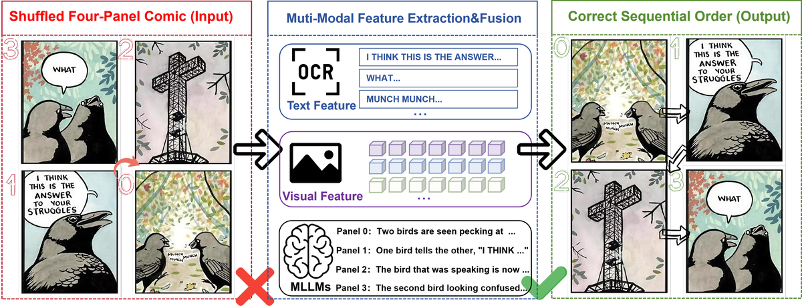
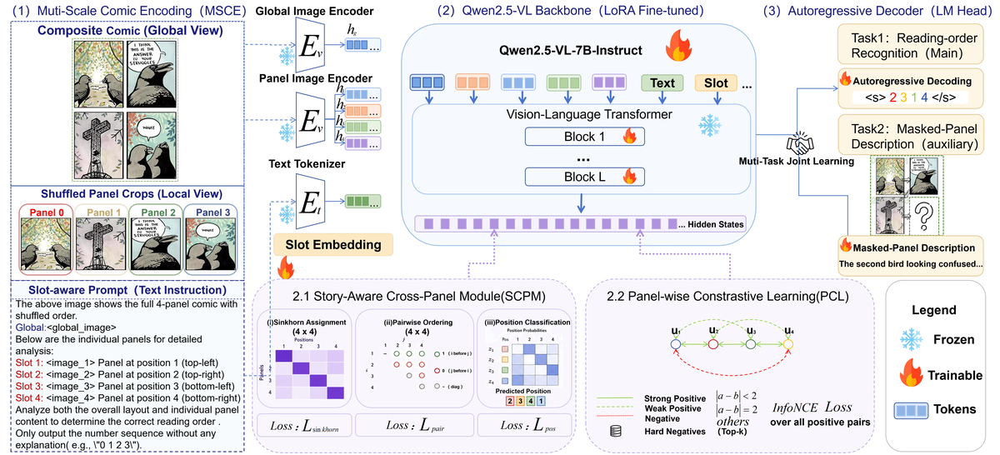
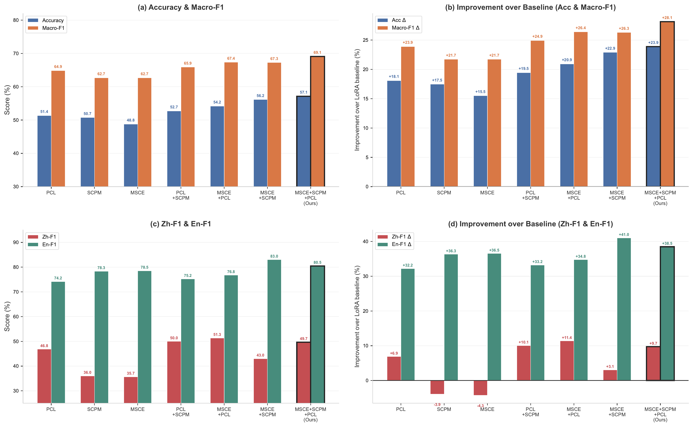

# Reading Between the Panels: Structured Multimodal Reasoning for Comic Narrative Understanding

<p align="center">
  
  
  
  
</p>

<p align="center">
  <b>四格漫画多模态逻辑推理</b>
</p>

---

## 📖 Abstract

Comic reading-order recognition is a representative multimodal narrative understanding task that requires models to rearrange shuffled four-panel comics into the correct sequence. Existing methods suffer from three major limitations: **(i)** insufficient structural awareness, where panel-level understanding is not well aligned with the overall storyline; **(ii)** weak ordering reasoning ability, as existing methods fail to effectively integrate global layout with fine-grained panel-level details; **(iii)** limited cross-modal generalization.

To address these challenges, we propose a unified framework consisting of three key components:
- **Multi-Scale Comic Encoding (MSCE)** — integrates the entire composite comic image with individual panels to capture both global and local information simultaneously;
- **Story-Aware Cross-Panel Module (SCPM)** — introduces structured permutation supervision via differentiable Sinkhorn assignment to realize coherent and ordered sequence reasoning;
- **Panel-wise Contrastive Learning (PCL)** — enforces narrative-aware feature discrimination among panels via hard-negative loss to learn more separable panel embeddings under shuffled inputs.

Experimental results on **CCAC2025** demonstrate that our method significantly outperforms state-of-the-art methods, improving **Accuracy from 42.86% to 57.14%** and **Macro-F1 from 55.05% to 69.09%**.

---

## 🎯 Task Overview

Given a shuffled four-panel comic, the model must recover the correct narrative reading order (e.g., `"2 0 3 1"`). Unlike conventional vision-language tasks, this demands joint modeling of **visual semantics**, **temporal progression**, **causal relations**, and **cross-modal alignment**.

<p align="center">
  
  <br>
  <em>Figure 1: The four-panel comic reading-order recognition task.</em>
</p>

---

## 🏗️ Methodology

Our framework is built upon **Qwen2.5-VL-7B-Instruct** with LoRA fine-tuning. As illustrated below, the method comprises three complementary modules:

<p align="center">
  
  <br>
  <em>Figure 2: Overview of our proposed framework. (1) MSCE constructs five visual inputs; (2) SCPM injects structured ordering supervision; (3) PCL enforces narrative-aware feature discrimination.</em>
</p>

### 1. Multi-Scale Comic Encoding (MSCE)

Instead of a single concatenated image, MSCE explicitly disentangles global and local evidence by using **five inputs**:
- One **global composite** image $v^{\text{global}}$ capturing page-level layout;
- Four **slot-tagged panel crops** $v^{\text{panel}}_1, \dots, v^{\text{panel}}_4$ at shuffled positions.

The prompt assigns explicit slot identifiers to each crop so that the model can align local details with global layout. This richer input evidence improves ordering reasoning without widening the backbone itself.

### 2. Story-Aware Cross-Panel Module (SCPM)

SCPM imposes explicit structural constraints on panel-to-position assignments via three complementary objectives:

**Sinkhorn Permutation Learning.** We model panel-to-position assignment using a soft permutation matrix $\mathbf{P} \in \mathbb{R}^{4 \times 4}$, obtained via differentiable Sinkhorn normalization:

$$
\mathbf{P} = \text{Sinkhorn}\!\left(\frac{\boldsymbol{\ell}}{\tau}\right), \quad \tau = 0.5
$$

The loss is cross-entropy over assignments against the ground-truth permutation matrix.

**Pairwise Ordering Loss.** To model relative precedence, we predict a score $s_{ij}$ indicating whether panel $i$ should appear before panel $j$, trained with masked binary cross-entropy.

**Position Classification.** As an auxiliary signal, each panel is classified into its narrative position.

The composite SCPM objective is:

$$
\mathcal{L}_{\text{scpm}} = \mathcal{L}_{\text{sinkhorn}} + \lambda_{\text{pair}} \mathcal{L}_{\text{pair}} + \lambda_{\text{pos}} \mathcal{L}_{\text{pos}}
$$

### 3. Panel-wise Contrastive Learning (PCL)

PCL improves feature-level discrimination by pulling narratively adjacent panels closer and pushing distant panels apart:

- **Positive pairs**: panels with narrative distance $\leq 2$ (adjacent + one-panel separation);
- **Negatives**: non-adjacent panels within the same comic, panels from other samples, and a FIFO ring buffer of size 128;
- **Hard-negative mining**: retain only the top-$K=32$ negatives with highest cosine similarity;
- **InfoNCE loss** with learnable temperature $\tau_{\text{cl}}$ clamped to $[0.03, 1.0]$.

### Overall Training Objective

$$
\mathcal{L}_{\text{total}} = \mathcal{L}_{\text{lm}} + \lambda_{\text{scpm}} \mathcal{L}_{\text{scpm}} + \lambda_{\text{pcl}} \mathcal{L}_{\text{pcl}}
$$

We set $\lambda_{\text{scpm}} = \lambda_{\text{pcl}} = 0.01$ with a linear warmup over the first 150 steps.

---

## 📊 Experimental Results

### Main Results (CCAC2025 Validation Set)

| Model | Acc | Macro-F1 | Zh-F1 | En-F1 |
|:------|:---:|:--------:|:-----:|:-----:|
| Qwen3-VL-8B (Zero-shot) | 7.88 | 46.18 | 33.67 | 53.52 |
| Qwen2.5-VL-7B (Zero-shot) | 7.88 | 27.09 | 24.00 | 28.91 |
| ViT+BiLSTM | 29.06 | 42.36 | 24.67 | 52.73 |
| ResNet50+BiLSTM | 31.03 | 44.95 | 34.67 | 50.98 |
| CLIP+MLP | 42.86 | 55.05 | 26.00 | 72.07 |
| ASTERX | 32.02 | 44.33 | 35.33 | 49.61 |
| Qwen2.5-VL-7B (LoRA, single-image) | 33.26 | 40.96 | 39.94 | 41.98 |
| **Ours (MSCE + SCPM + PCL)** | **57.14** | **69.09** | **49.67** | **80.47** |

Our method achieves substantial gains over the same-backbone single-image setting (+23.88% Acc, +28.13% Macro-F1), confirming that the improvement stems from our proposed design rather than backbone capacity.

### Ablation Study

<p align="center">
  
  <br>
  <em>Figure 3: Ablation study results. All modules are built upon the Qwen2.5-VL-7B LoRA backbone.</em>
</p>

| Configuration | Acc | Macro-F1 | Zh-F1 | En-F1 |
|:--------------|:---:|:--------:|:-----:|:-----:|
| LoRA Baseline (single-image) | 33.26 | 40.96 | — | — |
| + PCL only | 51.35 | 64.86 | 46.83 | 74.18 |
| + SCPM only | 50.74 | 62.68 | 36.00 | 78.32 |
| + MSCE only | 48.77 | 62.68 | 35.67 | 78.52 |
| MSCE + PCL | 54.19 | 67.36 | 51.33 | 76.76 |
| MSCE + SCPM | 56.16 | 67.27 | 43.00 | **83.01** |
| **MSCE + SCPM + PCL** | **57.14** | **69.09** | **49.67** | 80.47 |

**Key findings:**
- **MSCE alone** already surpasses CLIP+MLP (48.77% vs 42.86%), confirming the benefit of multi-scale inputs.
- **SCPM** and **PCL** provide complementary improvements; PCL achieves higher Zh-F1, while SCPM excels on En-F1.
- The full recipe achieves the best overall performance, validating that multi-scale encoding, structured supervision, and contrastive learning are mutually beneficial.

---

## 📁 Project Structure

```
.
├── assets/                              # Paper figures
│   ├── fig1.png                         # Task illustration
│   ├── fig2.png                         # Framework overview
│   └── fig3_ablation.png                # Ablation results
│
├── comic_innovation/                    # Core innovation modules
│   ├── balance_task1_data.py            # Permutation-level data balancing
│   ├── contrastive_loss.py              # Panel-wise contrastive learning (PCL)
│   ├── generate_missing_perms.py        # Synthetic sample generation
│   ├── panel_extractor.py               # 2×2 composite image splitting
│   ├── preprocess_multiscale.py         # Multi-scale dataset construction (MSCE)
│   └── story_attention.py               # Story-aware attention with Sinkhorn (SCPM)
│
├── panel_order_mm_pipeline/             # Baseline reproduction & ablation studies
│   ├── src/
│   │   ├── prepare_data.py              # Panel splitting + ViT feature extraction
│   │   ├── train.py / train_v2~v4.py    # Multimodal temporal ordering models
│   │   └── evaluate.py / evaluate_v2~v4.py
│   ├── scripts/run_all.sh               # One-command baseline pipeline
│   ├── requirements.txt
│   └── README.md                        # Detailed baseline documentation
│
├── panel_order_vit_pipeline/            # ViT-only baseline
│
├── LlamaFactory/                        # Fine-tuning framework (custom configs + dataset)
│   ├── data/ccac2025_complete/          # CCAC2025 dataset metadata & annotations
│   │   ├── dataset_info.json            # Dataset registration for LlamaFactory
│   │   └── README.md                    # Dataset documentation
│   ├── train_*.yaml                     # Task-specific training configurations
│   ├── src/                             # LlamaFactory source (minimal, ~3MB)
│   └── run_task2_push_train.sh          # Example training script
│
└── README.md                            # This file
```

---

## 🚀 Quick Start

### Environment Setup

```bash
# Clone the repository
# git clone <anonymous-repo-url> (available upon acceptance)
cd Reading-Between-the-Panels-Structured-Multimodal-Reasoning-for-Comic-Narrative-Understanding

# Install baseline dependencies
pip install -r panel_order_mm_pipeline/requirements.txt

# Install LlamaFactory (for VLM fine-tuning)
cd LlamaFactory
pip install -e .
cd ..
```

### Run the Baseline Pipeline

```bash
cd panel_order_mm_pipeline
bash scripts/run_all.sh
```

### Fine-tune Qwen2.5-VL with LlamaFactory

We provide a family of training configurations under `LlamaFactory/train_*.yaml`:

| Config | Description |
|--------|-------------|
| `train_ccac2025_task1_sota.yaml` | Task 1 best config (LoRA rank=32, MSCE+SCPM+PCL) |
| `train_task1_ms_v3_full.yaml` | Full innovation stack |
| `train_task1_ms_v3_baseline.yaml` | Baseline ablation |

```bash
cd LlamaFactory
# Download Qwen2.5-VL-7B-Instruct from HuggingFace first
# Then update model path in yaml and run:
llamafactory-cli train train_ccac2025_task1_sota.yaml
```

### Use Innovation Modules in Your Code

```python
from comic_innovation.story_attention import StoryAwareModule
from comic_innovation.contrastive_loss import PanelContrastiveLoss

# Attach to your vision-language model
story_module = StoryAwareModule(hidden_dim=3584, num_panels=4)
cl_loss = PanelContrastiveLoss(hidden_dim=3584, proj_dim=128)
```

---

## 📝 Notes

- **Pre-trained model weights** (e.g., Qwen2.5-VL-7B) are **not included**. Please download them from HuggingFace / ModelScope.
- **Dataset images** are excluded due to size constraints. JSON annotations and metadata are provided under `LlamaFactory/data/ccac2025_complete/`.
- **Trained checkpoints** are excluded; training scripts and configurations are provided for full reproducibility.

---

## 📚 Citation

If you find this work useful, please consider citing:

```bibtex
@inproceedings{anonymous2026reading,
  title={Reading Between the Panels: Structured Multimodal Reasoning for Comic Narrative Understanding},
  booktitle={NLPCC},
  year={2026}
}
```

---

## 📄 License

This project is licensed under the [Apache License 2.0](LICENSE).

---

<p align="center">
  <i>"Reading between the panels — where visual storytelling meets structured reasoning."</i>
</p>
